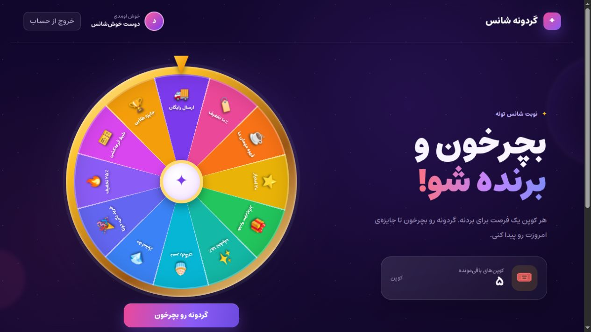
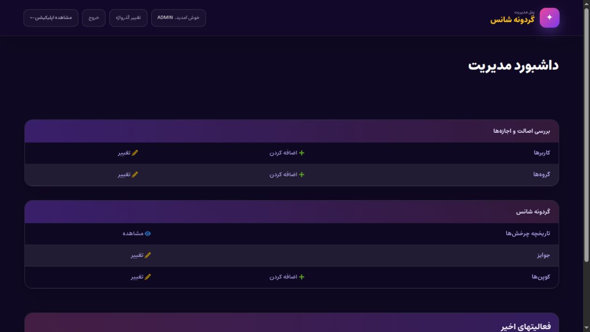

# Fortune Wheel

A responsive Persian RTL prize-wheel SPA built with Django, PostgreSQL, React, and TypeScript. Administrators assign coupons whose prizes are fixed before play. The server atomically consumes the oldest unused coupon, records an immutable award, and returns the slot where the twelve-sector wheel must stop.



## Administration

The localized Django Admin provides controlled prize management, coupon assignment, user administration, and a read-only spin audit trail.



## Core behavior

- The browser never selects or submits a prize.
- Each deliberate spin has a client-generated UUID sent as `Idempotency-Key`.
- Replaying one identifier for the same user returns the original `Spin` and never consumes another coupon.
- Pending identifiers have independent persistent keys per user and attempt. Each tab prefers its own request, and acknowledging one result preserves every other pending request. Legacy single-key attempts are migrated automatically.
- Recovery restores the recorded prize and snaps the wheel to its exact sector without starting a new animation. Subsequent spins continue from that position.
- Coupon selection, redemption, and `Spin` creation happen in one database transaction using PostgreSQL row locks.
- Every wheel catalog response must contain each unique slot from 0 through 11.
- `Prize.is_active` controls assignment to new coupons only. All twelve slots remain visible, and already issued coupons are honored after deactivation.
- A redeemed coupon's user, prize, and redemption state are immutable. Ordinary Django Admin operations cannot delete `Spin` records or alter fixed prize slots.
- Each `Spin` stores a compact prize snapshot. Later edits to prize display content do not rewrite historical awards.
- The winning wheel sector uses that same snapshot, so its label, icon, color, result dialog, and history agree even after an administrator edits the catalog.
- User-facing copy is Persian and centralized in locale/content resources. Source code, API details, tests, and documentation are English.

## Prerequisites

- Python 3.13 or 3.14
- [uv](https://docs.astral.sh/uv/) 0.12 or compatible
- PostgreSQL (the standard runtime)
- Node.js 24.15 or newer within the 24.x release line and pnpm 11.20.0 for frontend development
- Docker with Compose for the container workflow

## Docker Compose

Build and start PostgreSQL, Django/Gunicorn, and Nginx:

```bash
cp .env.example .env
docker compose up --build
```

The startup command installs no dependencies and does not create fixed-credential users. It applies migrations, collects static files, and starts Gunicorn from the environment created from `uv.lock`.

Create local evaluation data explicitly when wanted:

```bash
docker compose exec backend uv run --no-sync python manage.py seed_demo
```

Then open:

- Application: <http://localhost:8080>
- Django Admin: <http://localhost:8080/admin/>

Local evaluation credentials created by `seed_demo`:

| Role | Username | Password |
|---|---|---|
| User with five coupons | `demo` | `demo12345` |
| Administrator | `admin` | `admin12345` |

These credentials are for local evaluation only. Do not run `seed_demo` in production.

## Backend development with uv

PostgreSQL is used unless `USE_SQLITE=true` is explicitly set. Create a local PostgreSQL database and role matching your environment values first. Django reads the shell environment; it does not load `.env` automatically. After copying `.env.example` to `.env` at the project root, load it and point `POSTGRES_HOST` to your local database:

```bash
cd backend
set -a
source ../.env
set +a
export POSTGRES_HOST=localhost
uv sync --frozen
uv run python manage.py migrate
uv run python manage.py seed_demo
uv run python manage.py runserver
```

`backend/uv.lock` is the authoritative dependency source. `backend/requirements.txt` is a compatibility export generated with:

```bash
uv export --frozen --no-dev --no-hashes -o requirements.txt
```

For a lightweight local check only, opt in to SQLite:

```bash
cd backend
USE_SQLITE=true uv run python manage.py migrate
USE_SQLITE=true uv run python manage.py test
```

SQLite cannot validate `SELECT FOR UPDATE`, transaction interleaving, or the PostgreSQL concurrency regressions.

## Frontend development

```bash
corepack enable
corepack prepare pnpm@11.20.0 --activate
cd frontend
pnpm install --frozen-lockfile
pnpm run dev
```

Vite serves <http://localhost:5173> and proxies `/api`, `/admin`, and `/static` to Django at port 8000.

The default settings, Compose environment, and `.env.example` trust both `localhost` and `127.0.0.1` at ports 5173 and 8080. If reusing an older `.env`, add the two port-5173 origins to `DJANGO_CSRF_TRUSTED_ORIGINS`. Vite uses a strict port so it cannot silently switch to an origin outside this list.

Persian UI messages live in `frontend/src/locales/fa.json`. Components use English translation keys. Localized demo prize content lives in `backend/wheel/localized_content/fa.json`. Django Admin source strings are English gettext messages translated by `backend/wheel/locale/fa/LC_MESSAGES/django.po`.

The initial migration reads its original twelve prizes from the frozen `backend/wheel/migrations/data/0001_prizes_fa.json` localization resource. Keep this snapshot unchanged; editable demo content belongs in `localized_content/fa.json`. Moving the identical seed values out of Python and translating field metadata leaves migration names, dependencies, database columns, and existing data intact. Migration `0002` adds request identifiers and historical snapshots to existing rows.

## API

All expected API failures return JSON with a stable English `code`. The Persian SPA maps those codes to localized messages and never displays raw browser/network exceptions.

| Method | Path | Purpose |
|---|---|---|
| `GET` | `/api/auth/csrf/` | Initialize the CSRF cookie and return the token |
| `POST` | `/api/auth/login/` | Validate a JSON object and create a Django session |
| `POST` | `/api/auth/logout/` | End the current session |
| `GET` | `/api/auth/me/` | Return profile, current coupon count, and recent history |
| `GET` | `/api/prizes/` | Return the validated twelve-slot catalog |
| `POST` | `/api/spin/` | Create or replay a spin using the `Idempotency-Key` UUID header |
| `GET` | `/api/spin/<request-id>/` | Recover that authenticated user's result |

The spin response always returns the original award plus a freshly queried `remainingCoupons` count. A retry therefore preserves immutable award data while refreshing mutable account metadata. Recovery is owner-scoped; one user receives `SPIN_NOT_FOUND` for another user's request identifier.

Important error codes include `AUTH_REQUIRED`, `CSRF_FAILED`, `INVALID_JSON_OBJECT`, `INVALID_CREDENTIAL_FIELDS`, `INVALID_CREDENTIALS`, `INVALID_IDEMPOTENCY_KEY`, `NO_COUPONS`, `SPIN_NOT_FOUND`, and `CATALOG_INVALID`.

## Administration policy

1. Create a coupon and select its user and preassigned prize.
2. Only active prizes appear for new coupon assignment.
3. Deactivation does not remove a sector or invalidate existing coupons.
4. Existing prize slots cannot be changed through ordinary Admin operations, and prizes cannot be added or deleted there.
5. Once redeemed, a coupon's user, prize, and redemption timestamp are read-only and model-level validation rejects changes.
6. Spin audit records are read-only and cannot be deleted through ordinary Admin operations.

## Verification commands

Backend consistency and lightweight test run:

```bash
cd backend
uv sync --frozen
USE_SQLITE=true uv run python manage.py check
USE_SQLITE=true uv run python manage.py makemigrations --check --dry-run
USE_SQLITE=true uv run python manage.py test
```

Full PostgreSQL regression run inside Compose:

```bash
docker compose exec -T backend uv run --no-sync python manage.py test --noinput
```

This includes separate-connection concurrency tests for one-identifier replay and distinct simultaneous attempts, plus rollback, ownership isolation, authentication, CSRF, catalog policy, malformed login bodies, and audit immutability.

Frontend tests and production build:

```bash
cd frontend
pnpm install --frozen-lockfile
pnpm test
pnpm run build
```

The frontend suite covers 288 rotation cases, malformed protocol responses, localized transport errors, startup retry, reload recovery and wheel alignment, subsequent-spin continuity, preservation of another tab's pending result, updated award display content, expired-session preservation, transition-driven completion, and dialog focus/Escape restoration.


## Source archive

The delivery ZIP contains both applications, migrations, `uv.lock`, `pnpm-lock.yaml`, localization resources, `.env.example`, and this README. It excludes virtual environments, `node_modules`, build output, databases, caches, secrets, screenshots, and review files.
